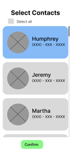

# Contact Conundrum

## Reason for Making the App

The primary objective of this app is to transform the process of acquiring contacts into an engaging and gamified learning experience. In a world where memorizing phone numbers has become a thing of the past, our app aims to make the task of gathering and remembering contacts not only functional but also enjoyable.

## Elements Used

The app is built using the following technologies:

- **Node.js:** Used for server-side development.
- **Axios:** A promise-based HTTP client for making API requests.
- **HTML, CSS, JS:** Front-end technologies for creating the user interface.
- **Bootstrap:** Mobile first CSS framework.
- **Express:**  A back end web application framework for building RESTful APIs with Node.js

## Future Implementations

Explore possible future features or enhancements, such as adding a ranking system or implementing an area code game.

## How to Use

Provide clear instructions on how users can interact with the app, including any setup requirements or dependencies.

1. Initial Setup: Select which contacts will be included in the game.
- 
2. Select your game mode: Normal Play or Daily Challenge.
3. Guess contact name or area based on the hints provided for you.
4. Click "Go!" to enter your submission.
5. If your guess is correct you will recieve currency. If not you will lose a heart.

## How to Contribute

Encourage others to contribute to the project by providing guidelines on how they can clone, fork, make changes, and submit their contributions for review.

1. Clone the repository.
2. Create a new branch for your changes.
3. Make your changes and test thoroughly.
4. Submit a pull request for review.

## Credits

Acknowledge and give credit to individuals who have contributed to the project:

- **Jonas Garibay**
- **Garrett Smith**
- **Phil Hail**

 

